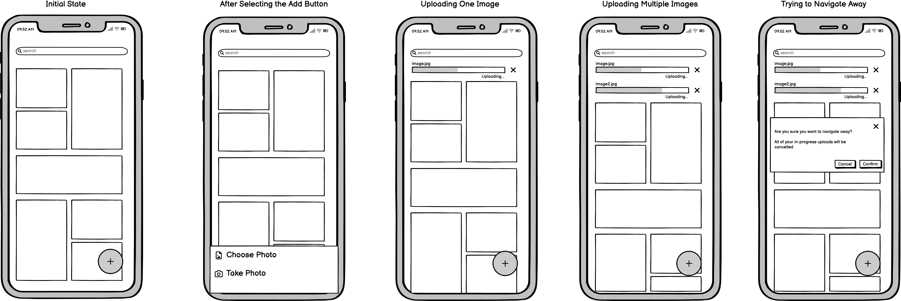
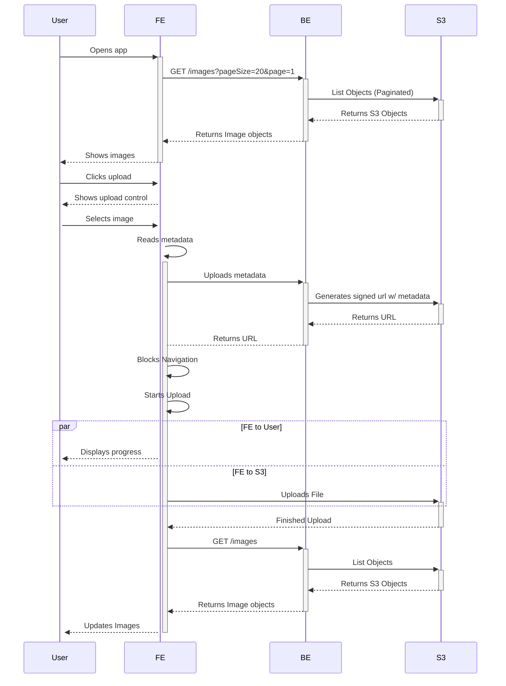
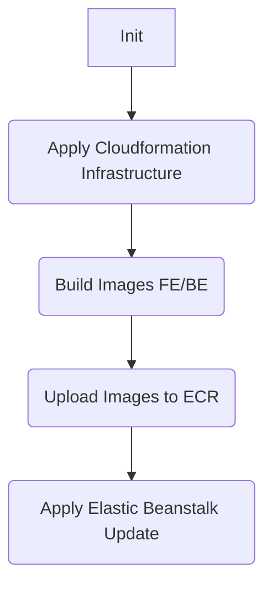

# Image Store

## Requirements and Description

Assume you’re working on a photo sharing site. It has a front-end built with Next.js and a back-end using Express on Node, with S3 for storing images. There could be a database, either relational or NoSQL, accessible to the back-end.

The ask: Focusing on the Next.js front-end build a design document with a UI and an architectural plan to implement a user flow for mobile devices to add a new photo.

Particular things we’re looking for:

1. How would you manage storing and displaying the image, image name, or metadata prior to uploading?
2. How would you display this information to the user?
3. On upload, how can we ensure the User doesn’t have a poor experience waiting for the upload?
4. What tools/processes were used to provide current upload state and status to the User?
5. If there are back-end considerations for implementing this feature on the front-end that might affect your architecture or implementation please include what those are and how they affect your choices.
6. How would you approach the flow for a user with 12 photos on the site versus a user with 1200 photos? We’re very interested in your opinions on ways to improve the user experience

## Key Points

Gathered from the requirements these are the focus points for the project:

- Mobile Focused
- User Experience
- 12 vs 1200 photos (scalability)

## Predefined Stack

Based on the project description the base requirements specify to use the following technologies:

- Next.js
- S3
- Express
- Database (optional)

## Frontend

The Next.js (FE) application should take care of displaying the images to the user, as well as providing an interface to upload the assets.
In this case, the idea is for this application to be lightweight and simple to deploy, in this case we'll be dockerizing next.js so it can be uploaded to ECR and later on deployed to Elastic Beanstalk.

### User Experience

Following the practices from modern social media applications, ideally the user should be able to keep interacting with the interface while the assets are being uploaded.
In this case, after the user has confirmed the image to be uploaded, the app will display the state from each of the in progress images at the top of the screen, with the ability to keep scrolling and/or add more images.

### Reading the File Metadata

As part of the [File](https://developer.mozilla.org/en-US/docs/Web/API/File) object specs you get the metadata info once the image its uploaded, then it can be stored within the application memory for later use.

### Tech Stack

- [react-query](https://react-query-v3.tanstack.com/) - Easy to use, it comes with an internal state management tool and allows you to write your own custom network logic.
- [axios](https://axios-http.com/) - Well known and rounded library to connect to remote APIs.
- [styled-components](https://styled-components.com/) - Used for styling and UX.
- [Docker](https://www.docker.com/) - Its going to be used to create the stand alone next.js app to be deployed later on.

### Wireframes

## Backend

The backend will basically function as a passthrough between the FE application and S3, to generate the signed urls and list the bucket objects

### Tech Stack

- [AWS-SDK](https://www.npmjs.com/package/aws-sdk) - Used to S3 generate signed urls and list bucket objects.
- [Docker](https://www.docker.com/) - Application will be dockerized to be deployed to Elastic Beanstalk.
- [OpenAPI](https://www.openapis.org/) - Both FE and BE should be using Typescript, and in order to not duplicate efforts, OpenAPI will be used to generate the base contracts and types for both sides.

### Wait, No Database?

The S3 SDK supports uploading and generating signed urls and [adding metadata](https://docs.aws.amazon.com/AWSJavaScriptSDK/latest/AWS/S3.html#putObject-property) to each of the objects. The advantages of using this instead of including a Database are:

1. No need to provision a database instance (lower costs, less complexity).
2. Object state management done by S3, if the image hasn't been uploaded then the object won't show up aas part of the list.
3. Avoiding the I/O operations from the server side.

## AWS

The AWS infrastructure will be managed as `infra-as-code` having a Cloudformation stack to provision all of the required resources and services.

### Tech Stack

- [S3](https://aws.amazon.com/s3/) - Main data store.
- [ECR](https://aws.amazon.com/ecr/) - To store and keep track of FE/BE docker image versions.
- [Elastic Beanstalk](https://aws.amazon.com/elasticbeanstalk/) - To deploy both the FE and BE apps.
- [CloudFormation](https://aws.amazon.com/cloudformation/) - Main Infra as code tool.

## Uploading an Image Sequence Diagram

## Deployment Flow Chart

