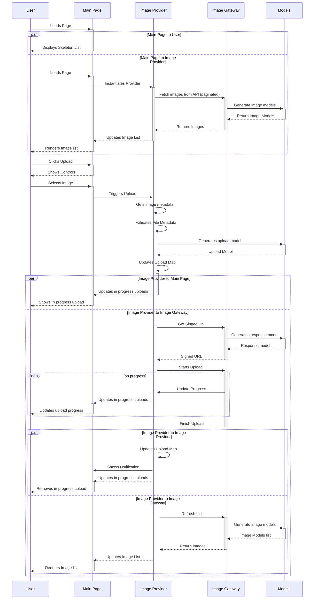

# In-Depth Frontend Architecture

In this part of the documentation is focused on the nitty and gritty around the front end architecture, discussing the following topics:

1. Scaffolding & Folder Structure
2. State Management
3. Entities, Standards and How Tos
4. Rendering the Home page
5. Unit and End to End tests

## Scaffolding & Folder Structure

### Next.js template

The first thing to consider will be the starting point of the application. In this case as we want to use `Typescript` as the main tool and type safety, we can choose this [next.js template](https://nextjs.org/docs/basic-features/typescript) which has the pre-installed toolset to work with `Typescript`.

### Why Typescript?

Typescript has become a no-brainer in the Javascript word because of its easy of use, flexibility and extensive toolkit for type safety approaches. Using Vanillay JS can be often difficult when it comes to having an easy way to understand how different parts of the system interact with each other, if you have I/O operations using type checks you can understand the expected information that is going to flow through, and not just guess based on a few tries.

Another keypoint for React is that in case you want to support something similar like PropTypes, you might end up adding extra overhead to components and not only that but PropTypes are only targeted for React Components and will leave the rest of the app with any possible type check.

#### Downsides

Can cause some initial overhead issues to structure the required types and having the team used to using the tool.

### Folder Structure

React is a really powerful library that allows you to build great Frontend applications, the problem is that it doesn't provide an strict standard on how to structure the application directories, in this case leaving the developers decide what's best for their use case.

In this case, the most common and well known pattern is the container-component one, which defines a standard on how to distribute the code across the project.
For Next.js it includes already a predefined structure that allows you to follow this pattern from the beginning, you can define `pages` as top level components(containers) and the rest of the three can be part of the `components` folder.

Directories diagram

```
/image-store
  /pages
  /components
  /types
  /providers
  /utils
  /models
  /hooks
  /gateways
  /constants
  /services
  /assets
```

#### Downsides

1. Even if this is a well-known pattern, it might cause some issues in the long run when it comes to considering what makes a reusable component truly reusable.
2. There is a fine line between a container and a component since the inclusion of Context API and hooks.

### Naming Conventions

A big part of having a good development experience while working on an application is to been able to identify files quickly, understanding what each file means and having an simple way to add more to the project.

In this case, I believe that having the entity type attached clearly to the filename can be really helpful, the following table shows how each filename should be constructed based on the type.

| Type      | FileName                                   |
| --------- | ------------------------------------------ |
| Component | Image.tsx                                  |
| Provider  | NameOrThe.provider.tsx, Image.provider.tsx |
| Types     | NameOfThe.type.ts, Images.types.ts         |
| Gateways  | NameOfThe.gateway.ts, Images.gateway.ts    |
| Models    | NameOfThe.model.ts, Image.model.ts         |
| Constants | NameOfThe.constants.ts, Image.constants.ts |
| Hooks     | useImage.ts(x)                             |
| Utils     | Common.utils.ts                            |
| Services  | NameOfThe.service.ts(x), Image.service.ts  |
| Styles    | Image.styled.ts, Modal.styles.ts           |

#### Downsides

- Names can become quite long
- For some types you have to break the naming convention to follow the framework standards (next.js pages/ react hooks)

### Exporting/Importing a module

When it comes to exporting a module, that could be from a React Component, Provider, Gateways, etc. We want to focus on two main points:

1. Avoid having to import a module from a far parent folder, similar to `../../../../../folder/Component/Component.tsx`. This can be easily fixed by configuring `Typescript` to use the root folder as an absolute path, updating the import to `folder/Component/Component.tsx`.
2. Having a clear entry point for the imported/exported module. To fix this, we will be using indexes files as a main entry point, each module that consist in multiple files like:

```
/Component
 Component.tsx
 Component.style.ts
 hooks/
  useComponent.ts
```

Should include an `index.ts` file that exports the main entry point similar to:

```ts
export {default} from './Component';
```

Allowing external modules importing it directly from the parent folder `import folder/Component`.

#### Downsides

- You'll have to include an extra `index.ts` file for each module.

## State Management

There is a big debacle in the React community about the usage of different state management tools, the biggest issue is when and why you should consider using one.
And I believe the topic hot even more complex after the addition of Providers and hooks.

Let's consider some of the options:

### Vanilla React

The latest versions of React provide you with tools that you can use for simple scenarios where you'll need to have some sort of state management for your application, adding it to the question of, is it really needed to have a separated library for this?

**Pros:**

- You can keep your app lightweight, as you avoid adding extra libraries to the build.
- Reducers are nativaly supported by React and can be used for scoped portions of the app or globally depending on the use case.
- Providers, context and hooks are great tools to spread the data across the component tree.

**Cons:**

- React still is a UI library, which doesn't include anything for I/O operations.
- Everything is added at the lifecycle level, so functions, so handling caching across the data, functions and other data types needs to be manually handled by the developers.
- As great as hooks can be, it can become cumbersome to have all of your business logic encapsulated in a concept that is framework specific.

### Redux-Toolkit

This is a great tool that works as a wrapper for the Redux library, it includes simpler APIs to enable fast development while still using Redux.
**Pros:**

- Includes simple ways for I/O implementations, and auto generates hooks for you to use, it also includes caching, error handling and more.
- You can keep using the same patterns as for Redux with Actions, Reducers if you want to keep having fine control of the state.
- Fully typed, so you can use it alongside `Typescript`.
- Side effects come out of the box by allowing cross action listeners for reducers.

**Cons:**

- It comes with an initial overhead of learning how Redux works, as it feels targeted for old users that want a new way of interacting with he same pattern.
- Includes several tools and APIs that you wont need unless you have a specific use case, it might be considered overkill for some apps.
- It includes its own custom way when creating I/O operations, in case you have generic logic you want to reuse you'll have to migrate them.

### React-Query

React query is an I/O abstraction that allows you create custom logic to connect to an API while also provides its own state management.

**Pros:**

- Allows you to decouple the actual API call from the React code, having your generic gateways doing the job.
- Native support for queries, mutations, paginated queries and more.
- Includes a tagging system for cache, so you can decide when to refetch certain queries.

**Cons:**

- It doesn't include a custom state management.
- It still uses hooks a primary API.

### Decision

Having worked on big enterprise level React apps and at the same time on smaller code bases, there are some compromises that you need to do based on the team, state of the business and overall development experience.

I believe that having overkill startegies when is not necessary can be as harmful as not having them when its necessary as it can slow the development process by adding extra overhead or quirks just to support something that can be simply done by just using React.

In this case the best combination for a small app like this, I believe that a combination of React's core state management system like hooks, providers, context, etc. Combined with a simple but powerful I/O tool like `react-query` should be the best fit.

As `react-query` allows you control the actual API request, you can create base gateways and custom responses (models) to use across the app, and the `providers` should be able to spread the information by custom hooks.

### State Data Structure

As `react-query` will do the heavy lifting to keep the image state and information in memory. The thing that we need to keep track will be the list of `in-progress` uploads. In this case we'll be using a native React [reducer](https://beta.reactjs.org/reference/react/useReducer), where we are going to store a key value map for the uploads, it should look as the following:

```json
{
 "upload-id":  UploadModel,
 "upload-id-2":  UploadModel,
}
```

And accessing the store to write should be done by dispatching changes to `add, delete and update`.

## Design-System

To ensure component reusability and avoid recreating the same components over and over, creating an set of initial `design-system` component which should provide the basic styles for commonly used controls like:

1. Buttons
2. Text
3. Modals
4. Colors

### Style-Components

The styled-component library becomes very handy when it comes to create extendible components based on a specific set of styles, it contains a `ThemeProvider` tha can be used to store the overall styling rules, like spacing, colors, fonts, etc.

### Storybook

The Storybook library is another great tool that can be used to create generic components while visualizing them before wiring them up with the rest of the application.

## Application Entities

- [Components](entities/Components.md)
- [Models](entities/Models.md)
- [Services](entities/Services.md)
- [Gateways](entities/Gateways.md)
- [Pages](entities/Pages.md)
- [Types](entities/Types.md)

## Rendering the Home Page

Acceptance Criteria:

AC1:
As a user landing on the main page
I should be able to see the loading state with skeleton items

AC2:
As a user landing on the main page
And the requests are finish loading
I should be able to see the image gallery

AC3:
As a user looking at the main page
And I scroll to the bottom of the page
I should be able to see the loading state when reaching the end
And when the loading is done
I should be able to see the second page of the images

AC4:
As a user looking at the main page
And I scroll to the bottom of the page
And I'm at the last page
I should see the no more items component

AC5:
As a user looking at the main page
I should be able to see the upload image button

AC6:
As a user looking at the main page
And I click the upload button
I should be prompted with the native controls to upload the image

AC7:
As a user looking at the main page
And I select an image from the gallery or I took a photo
I should be able to see the upload in progress
And the website should be entirely functional

AC8:
As a user looking at the main page
And I just uploaded an image
Once the upload ends
I should be able to see the updated list of images

AC9:
As a user looking at the main page
And I just uploaded an image
And I try to navigate away
I should see an alert to confirm the navigation action

### Component Tree

Pseudo code of the main page component tree:

```jsx
<Layout>
  <Navigation>
  <ImageProvider>
    <Page>
      <Main>
        <UploadInProgress>
        <UploadButton>
        <ImageList>
          <ImageCard>
          <NextPageTrigger>
```

### Pagination & Performance

To avoid performance problems, the list of images will be paginated in chunks of 20 items, every time the user reaches the end, the skeleton/loading state should be displayed for the new section and a new set of images will be added when finish.

Images will be loaded asynchronously and a loading state for each of the `img` tags will be added until the asset fully loads.

### Caching

The `react-query` library provides a very solid caching system, where the requests are only triggered when the tags are deleted from cache or the page fully reloads.

### Data Flow

Here is a diagram that showcases the interaction between the different entities of the application when a user uploads an image.



### Edge Cases

- What if the user selects an invalid asset type, e.g a video instead of an image? When displaying the native controls, the input should filter the assets to just accept the valid mimetypes, e.g image/jpg, image/png, etc. Aside from that, the file object should be validated before fetching the signed url.
- What happens in case the upload fails? App should display the upload status as failed and allow users to retry.
- What happens if the user moves to another side half-way during the upload? Navigation should be blocked that way if the user wants to move away there should be an alert to confirm the action, in case the user moves away the upload is lost.
- What happens if the name of the image is too long? The name should be part of the metadata but not the actual upload name, that way we can be sure the S3 restrictions are not broken.
- What if the asset is to big? Frontend should read the size of the file and validate if its something that can be uploaded, the backend should also specify the max size upload when signing the url, in case the asset is too big the upload will throw an error that should be displayed by the frontend.

## Unit and End to End tests

## Tooling

### Unit testing

As mentioned in the [official React docs](https://reactjs.org/docs/testing.html), they recommend to using Jest alongside React testing tools, these are by far the most suitable frameworks for testing react logic and components.

I believe tools like Enzyme or Jasmine where good at some point as workarounds when it comes to DOM manipulation and such, I think the simplest way today is to go with Jest plus React Testing Tools.

### End to End tests

For End to end Tests the most solid framework out there has to be Cypress, it natively supports Typescript so it goes along with the Frontend structure, as well as supporting multiple browser types like Chrome, Electron, Firefox, webKit, among others.
Has support for CI/CD processes where you can use the cloud version to get more insights around your tests.

It also has support for component testing but I think the feature is too new and lacks the maturity that the other tools provide.

## Testing Strategy

For unit testing, as most of the scenario are focused on testing isolated scenarios and there tents to be some mocking, the idea should be to focus on core components that contain the most critical amount of business logic, while components just used for rendering data have the lowest priority.

Base on the image store scenario, the focus should be around:

1. The provider as it handles the stage management and interacts with the gateways
2. Gateways to validate edge cases and model factories

For End to End Test a simple way to understanding what to test is going through the acceptance criteria, usually the requirements described there help understand what is exactly the expected behavior.

In this case we can go with:

1. Uploading an Image
2. Displaying the image list (validating pagination)
3. Cancel an Upload
